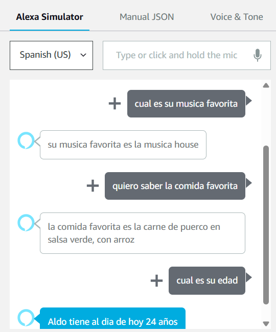
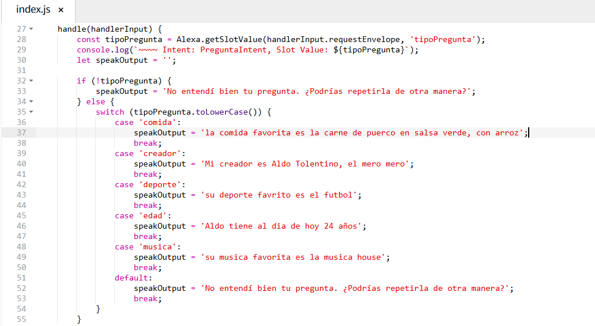

# DATOS DEL ESTUDIANTE
nombre: Aldo Tolentino Domingo
carrera: Ingeniería en Desarrollo de Software
profesor: Marco Antonio Ramírez Hernández
materia: Extracción de Conocimiento en Bases de Datos
grado_grupo: 9°A

    
    

 
 
     

# 📌 DESCRIPCIÓN DE LA SKILL
skill:
  nombre: hola despierta
  descripcion: 
    Esta skill responde por comandos de voz a cuatro preguntas estáticas definidas por el estudiante.
    Fue creada con el Alexa Skills Kit en Node.js usando la consola de desarrollo de Alexa.

# 🤖 INTENT PERSONALIZADO
intents:
  - nombre: PreguntaIntent
    slot: tipoPregunta
    tipo_personalizado: TIPO_PREGUNTA
    valores_slot:
      - comida
      - creador
      - deporte
      - edad
      - musica

# 🗣 UTTERANCES PERSONALIZADAS
utterances:
  - "¿Cuál es su {tipoPregunta}?"
  - "cual es su {tipoPregunta} favorita"
  - "quiero saber la {tipoPregunta} favorita"
  - "cuentame el {tipoPregunta}"
  - "que {tipoPregunta} es"
  - "sabes edad {tipoPregunta}"

  # Imagen de la practica

  

 

# 💬 RESPUESTAS ESTÁTICAS
respuestas_programadas:
  comida favorita: "la comida favorita es la carne de puerco en salsa verde, con arroz"
  creador: "Mi creador es Aldo Tolentino, el mero mero"
  deporte: "su deporte favorito es el futbol"
  edad: "Aldo tiene al dia de hoy 24 años"
  musica: "su musica favorita es la musica house"

# 🧪 PRUEBAS REALIZADAS
pruebas:
  - pregunta: "cual es su deporte favorito?"
    resultado: Correcto

  - pregunta: "¿Cuál es tu comida favorita?"
    resultado: Correcto

  - pregunta: "que edad tiene?"
    resultado: Correcto

  - pregunta: "sabes la musica favorita"
    resultado: Correcto

  - pregunta: "cual es su edad"
    resultado: Correcto

# 🧩 TECNOLOGÍAS UTILIZADAS
tecnologias:
  - Alexa Skills Kit SDK v2
  - Node.js (Alexa Hosted)
  - Alexa Developer Console

# 📁 ESTRUCTURA DEL PROYECTO
estructura:
  - index.js
  - skill.json
  - models/es-MX.json
  - lambda/custom/index.js
  - README.md

# 📌 RECOMENDACIÓN DE EJECUCIÓN
ejecucion:
  pasos:
    - Subir el código a Alexa Developer Console
    - Activar modo "Test"
    - Probar frases como "deporte favorito" o "cual es su musica favorita"

# ✅ RESULTADO FINAL
resultado: Skill funcional, desplegada y probada con éxito